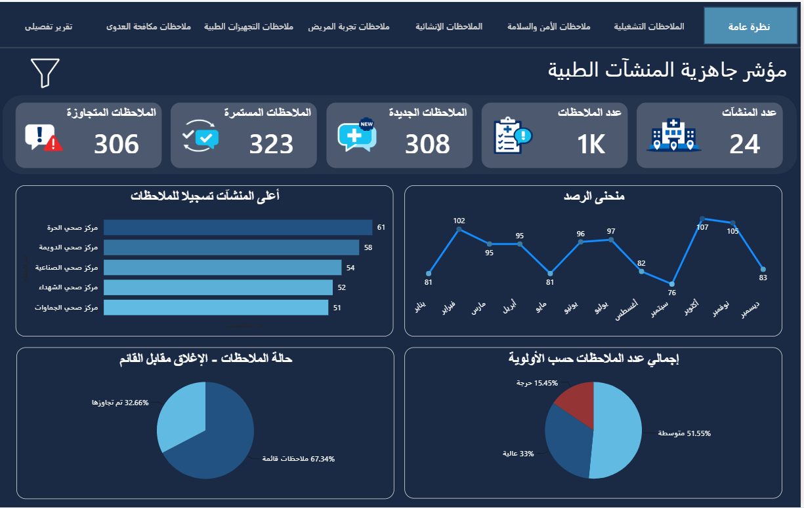
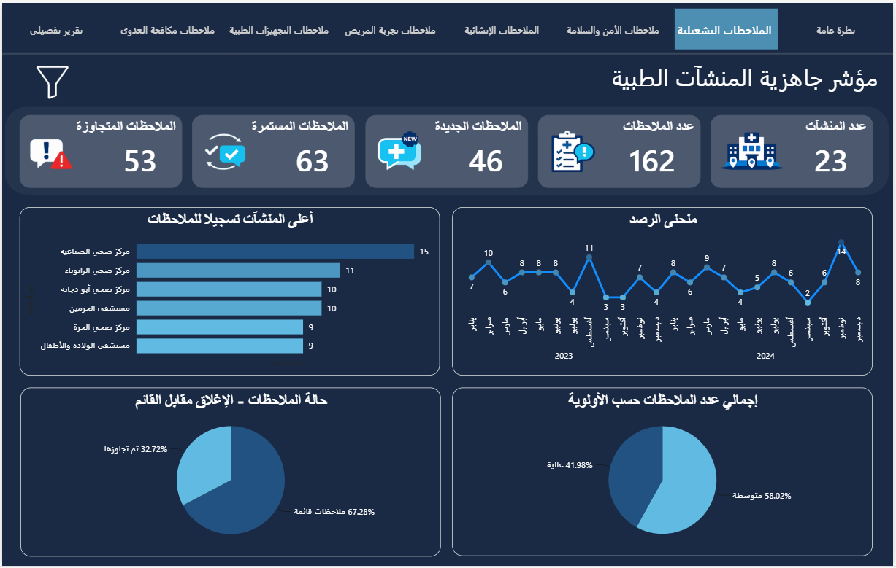
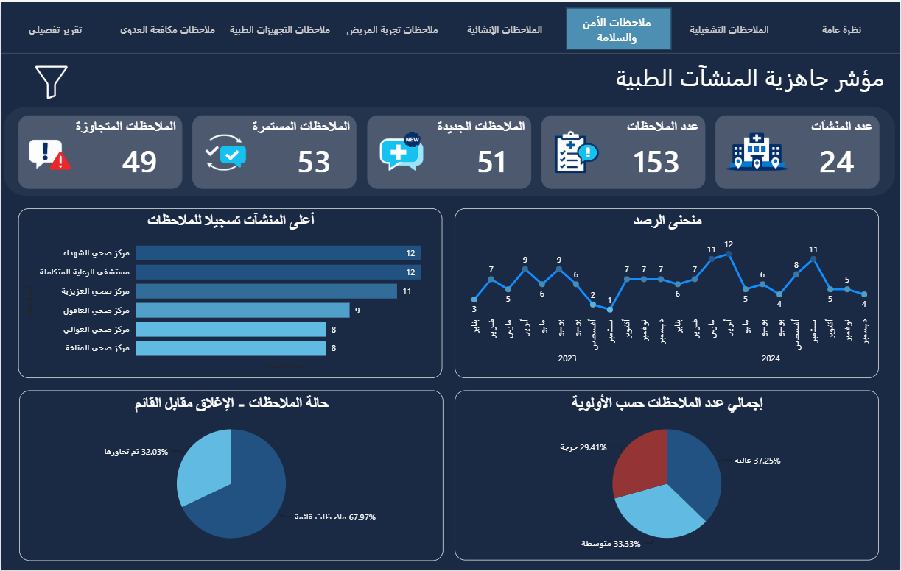
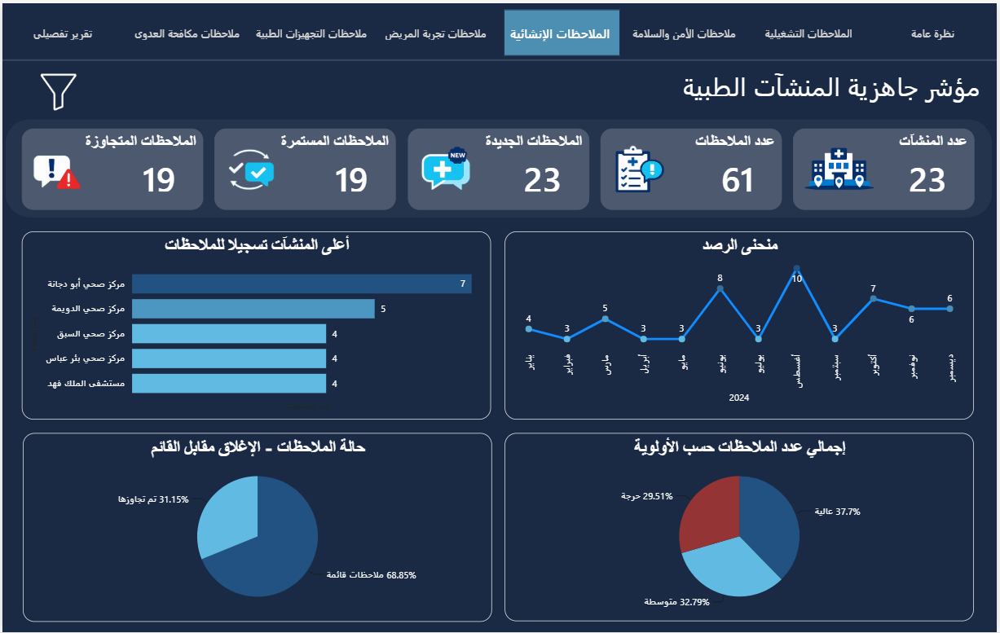
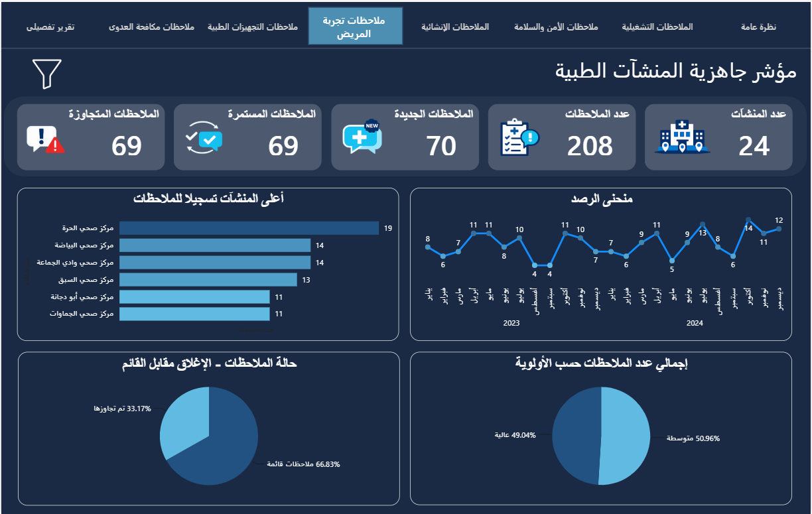
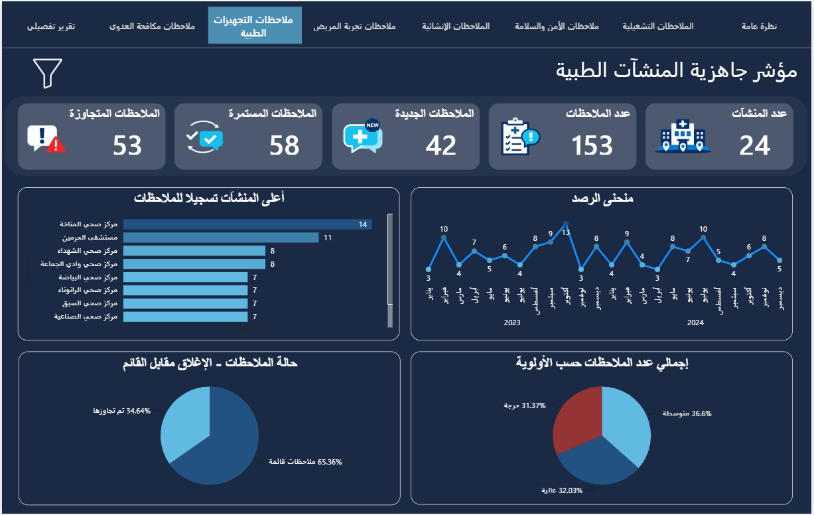
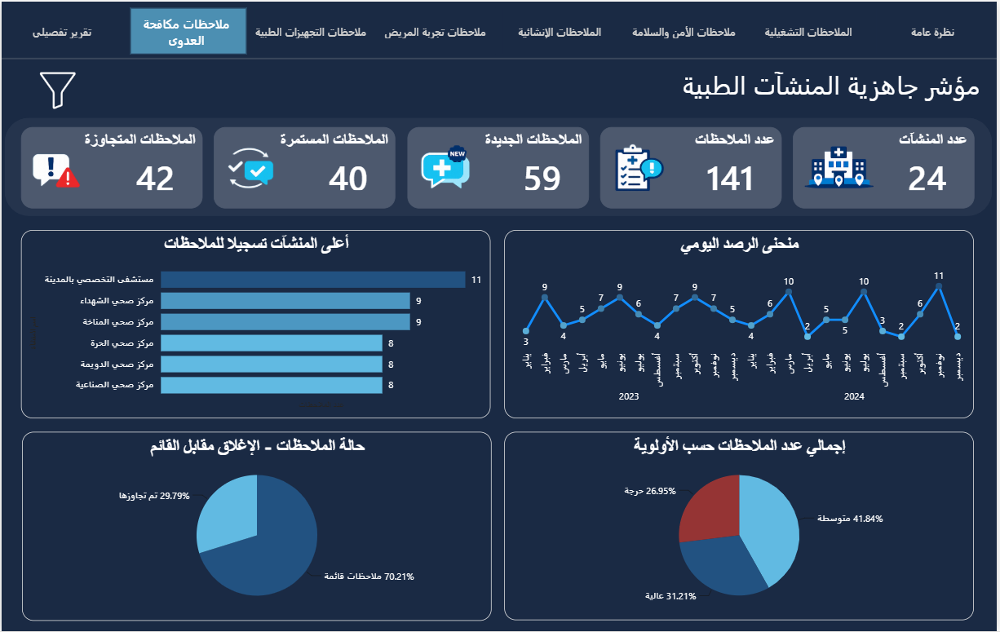
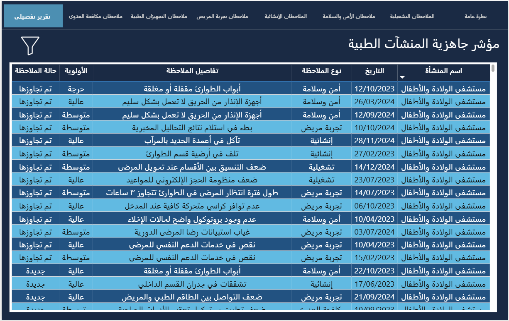

<div align="center">


# 🏥 Medical Facilities Readiness Index
### مؤشر جاهزية المنشآت الطبية

**An interactive Power BI report for monitoring and tracking observations across medical facilities**


</div>

---

## 📽️ Demo

> The GIF below plays automatically — it shows real-time filtering, cross-page navigation, and interactive charts.

<div align="center">
  
</div>


---

## 📋 Table of Contents

- [Demo](#️-demo)
- [Overview](#-overview)
- [Report Pages](#-report-pages)
- [Data Model](#-data-model)
- [Key Metrics & Visuals](#-key-metrics--visuals)
- [Filters & Interactivity](#-filters--interactivity)
- [Repository Structure](#-repository-structure)
- [Dataset](#-dataset)
- [Design Decisions](#-design-decisions)
- [Data Disclaimer](#️-data-disclaimer)

---

## 🔍 Overview

This Power BI report provides a **comprehensive monitoring dashboard** for tracking medical facility observations across multiple categories — from operational issues to infection control — enabling healthcare administrators to:

- 📊 **Monitor** the volume and trend of observations over time
- 🏥 **Identify** which facilities generate the most observations
- 🔴 **Prioritize** critical, high, and medium-severity issues
- 📈 **Track** open vs. closed observation rates for performance benchmarking
- 🔎 **Drill down** into specific observation types across 7 dedicated report pages

---

## 📄 Report Pages

The report consists of **8 pages**, all sharing the same KPI cards, charts, and filter structure. Each page (except the overview and detail table) applies a **page-level filter** to show only its relevant observation type.

| # | Page Name (Arabic) | Purpose | Page Filter |
|---|---|---|---|
| 1 | **نظرة عامة** — General Overview | Full picture across all observation types | None |
| 2 | **الملاحظات التشغيلية** — Operational | Staffing, scheduling, and process gaps | `نوع الملاحظة = تشغيلية` |
| 3 | **ملاحظات الأمن والسلامة** — Safety & Security | Fire safety, evacuation, surveillance | `نوع الملاحظة = أمن وسلامة` |
| 4 | **الملاحظات الإنشائية** — Structural | Building integrity, leaks, maintenance | `نوع الملاحظة = إنشائية` |
| 5 | **ملاحظات تجربة المريض** — Patient Experience | Wait times, communication, accessibility | `نوع الملاحظة = تجربة مريض` |
| 6 | **ملاحظات التجهيزات الطبية** — Medical Equipment | Device calibration, availability, repairs | `نوع الملاحظة = تجهيزات طبية` |
| 7 | **ملاحظات مكافحة العدوى** — Infection Control | Hand hygiene, sterilization, PPE compliance | `نوع الملاحظة = مكافحة العدوى` |
| 8 | **تقرير تفصيلي** — Detailed Report | Full data table with all observations | None |

---

### 🖼️ Report Screenshots

**Page 1 — نظرة عامة (General Overview)**


---

**Page 2 — الملاحظات التشغيلية (Operational)**


---

**Page 3 — ملاحظات الأمن والسلامة (Safety & Security)**


---

**Page 4 — الملاحظات الإنشائية (Structural)**


---

**Page 5 — ملاحظات تجربة المريض (Patient Experience)**


---

**Page 6 — ملاحظات التجهيزات الطبية (Medical Equipment)**


---

**Page 7 — ملاحظات مكافحة العدوى (Infection Control)**


---

**Page 8 — تقرير تفصيلي (Detailed Report)**


---

## 📊 Data Model

The dataset contains a **single flat table** with the following schema:

| Column (Arabic) | Column (English) | Data Type | Description |
|---|---|---|---|
| `اسم المنشأة` | Facility Name | Text | Name of the medical facility |
| `التاريخ` | Date | Date | Date of the inspection visit |
| `نوع الملاحظة` | Observation Type | Text (Category) | One of 7 observation categories |
| `تفاصيل الملاحظة` | Observation Details | Text | Free-text description of the finding |
| `حالة الملاحظة` | Observation Status | Text (Category) | `جديدة` / `مستمرة` / `تم تجاوزها` / `لا يوجد` |
| `الأولوية` | Priority | Text (Category) | `حرجة` / `عالية` / `متوسطة` |

### Observation Type Categories

```
أمن وسلامة      →  Safety & Security
إنشائية         →  Structural
تجربة مريض      →  Patient Experience
تجهيزات طبية    →  Medical Equipment
تشغيلية         →  Operational
مكافحة العدوى   →  Infection Control
لا يوجد ملاحظات →  No Observations
```

### Status & Priority Reference

| Status (Arabic) | Meaning | Priority (Arabic) | Severity |
|---|---|---|---|
| `جديدة` | New — first-time observation | `حرجة` | Critical |
| `مستمرة` | Ongoing — previously recorded | `عالية` | High |
| `تم تجاوزها` | Resolved — closed observation | `متوسطة` | Medium |
| `لا يوجد` | No observation on this visit | — | — |

---

## 📈 Key Metrics & Visuals

All pages (except the detailed table page) share the following layout:

### 🃏 KPI Cards

| Card | Measure Logic |
|---|---|
| **عدد المنشآت** | `DISTINCTCOUNT([اسم المنشأة])` |
| **عدد الملاحظات** | `COUNTROWS` excluding `لا يوجد ملاحظات` rows |
| **الملاحظات الجديدة** | CALCULATE(COUNT('Table2'[حالة الملاحظة]),'Table2'[حالة الملاحظة]="جديدة") |
| **الملاحظات المستمرة** | CALCULATE(COUNT('Table2'[حالة الملاحظة]),'Table2'[حالة الملاحظة]="مستمرة") |
| **الملاحظات المتجاوزة** | CALCULATE(COUNT('Table2'[حالة الملاحظة]),'Table2'[حالة الملاحظة]="تم تجاوزها") |
| **ملاحظات قائمة** | [عدد الملاحظات الجديدة]+[عدد الملاحظات المستمرة] |

### 📉 Charts

| Chart (Arabic) | Type | Description |
|---|---|---|
| **منحنى الرصد** | Line Chart | Observations over time — reveals trends, spikes, and seasonal patterns |
| **أعلى المنشآت تسجيلاً للملاحظات** | Bar Chart | Top 5 facilities by observation count — surfaces high-risk locations |
| **إجمالي عدد الملاحظات حسب الأولوية** | Pie Chart | Breakdown by Critical / High / Medium priority |
| **حالة الملاحظات - الإغلاق مقابل القائم** | Pie Chart | Closed vs. active observations — a key closure-rate KPI |

---

## 🎛️ Filters & Interactivity

All pages include the following **slicer filters**:

| Filter (Arabic) | Column | Behavior |
|---|---|---|
| **المنشأة** | `اسم المنشأة` | Dropdown / Multi-select |
| **التاريخ** | `التاريخ` | Date range picker |
| **الحالة** | `حالة الملاحظة` | Multi-select |
| **الأولوية** | `الأولوية` | Multi-select |

> 💡 **Note:** On specialty pages (2–7), slicers work *within* the existing page-level filter — selecting a facility on the Safety page shows only Safety observations for that facility.

---

## 🗂️ Repository Structure

```
medical-facilities-readiness-index/
│
├── 📁  data/
│   └── مؤشر_جاهزية_المنشآت_الطبية.xlsx       ← Synthetic dataset (1,100 rows)
│
├── 📁  assets/
│   ├── 
│   ├── screenshot-overview.png                ← Page 1 — نظرة عامة
│   ├── screenshot-operational.png             ← Page 2 — الملاحظات التشغيلية
│   ├── screenshot-safety.png                  ← Page 3 — الأمن والسلامة
│   ├── screenshot-structural.png              ← Page 4 — الإنشائية
│   ├── screenshot-patient.png                 ← Page 5 — تجربة المريض
│   ├── screenshot-equipment.png               ← Page 6 — التجهيزات الطبية
│   ├── screenshot-infection.png               ← Page 7 — مكافحة العدوى
│   └── screenshot-detail.png                  ← Page 8 — التقرير التفصيلي
└── demo.gif                                   ← Animated report demo
└── 📄  README.md

```

---


## 📦 Dataset

| Property | Value |
|---|---|
| File | `data/مؤشر_جاهزية_المنشآت_الطبية.xlsx` |
| Rows | 1,100 |
| Facilities | 24 |
| Date Range | January 2023 – December 2024 |
| Language | Arabic |
| Nature | **Synthetic / AI-Generated** — not real data |

---

## 🎨 Design Decisions

### Why a page-per-observation-type structure?
Healthcare managers responsible for different domains (e.g., engineering teams for structural issues, infection control officers for IPC) can go directly to their relevant page without navigating through unrelated data. The **نظرة عامة** page serves leadership with the complete picture.

### Why the same visual layout on every page?
Consistency reduces cognitive load. Once a user learns where the "top facilities" chart is on one page, they can navigate all 8 pages and always find it in the same position — enabling faster cross-category comparison.

### Closure Rate as a KPI
The **حالة الملاحظات — الإغلاق مقابل القائم** pie chart is intentionally framed as a performance indicator, not just a distribution. A high closure rate signals the organization is actively resolving findings rather than just recording them.

### Priority color coding

| Priority | Color | Hex |
|---|---|---|
| `حرجة` — Critical | 🔴 Dark Red | `#953434` |
| `عالية` — High | 🔵 Dark Blue | `#225281` |
| `متوسطة` — Medium | 🩵 Light Blue | `#61BAE2` |

The color palette was intentionally chosen to align with the report's overall theme and branding, maintaining visual consistency across all pages rather than using a generic traffic-light scheme.

---

## ⚠️ Data Disclaimer

> 🤖 **The data in this repository is entirely AI-generated and does not represent any real facility, patient, or operational information.**

This report is built on a **real project** designed to monitor and track observations across medical facilities. To preserve the **privacy and confidentiality** of the actual data, all values in this repository — including facility names, dates, observation details, and statuses — were **synthetically generated using AI** to mirror the structure, logic, and behavior of the original dataset, without exposing any real information.

The purpose of publishing this project is to demonstrate the **report design, data modeling approach, and analytical thinking** behind the work — not to disclose any sensitive operational data.

| | |
|---|---|
| **Original project** | Real — built for an actual healthcare context |
| **Data in this repo** | Synthetic — AI-generated to reflect the same structure |
| **Reason for anonymization** | Privacy protection & data confidentiality |
| **Generated using** | Python + Claude AI |

---

<div align="center">

*This project is part of a data analytics portfolio.*
*All data is synthetic. No real facility or patient information is included.*

</div>
